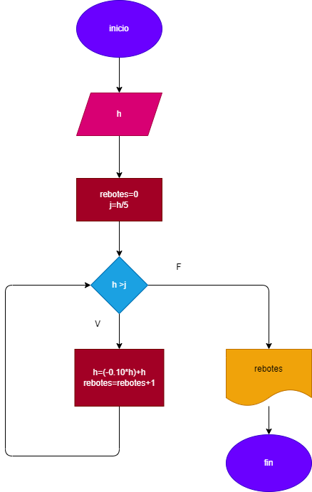

# rebotes-pelota

# Una pelota se deja caer desde un aaltura h, y en cada rebote sebe al 10% menos del anterior.Hacer el diagrama de flujo y el programa en phyton ,que lea h, y que calcule e imprima en caul revote la pelota no alcanza a subir la quita parte de la altura inicial.

#
# ANALISIS:
# Para hacer el problema necesitamos calcular cuanto es el 10 % menos de la altura y la quina parte de la altura inicial y con  las respectivas instricciones logicas contar cuantos rebotes da la pelota antes de no alcansar la quinta parte de la altura inicial. 

# Diagrama de flujo:
